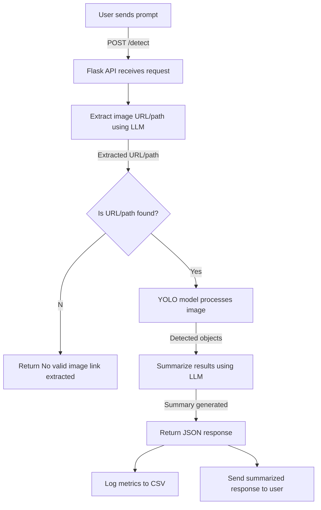

# YOLO-Ollama Object Detection System

## Overview
This repository implements an image analysis system that integrates:
- **Ollama LLM** for extracting image URLs or paths from user queries.
- **YOLO (You Only Look Once)** for object detection on the extracted image.
- **Ollama LLM** again for summarizing detected objects.
- **Flask API** for handling user requests and processing the workflow.
- **CSV Logging** for tracking inference time and model performance.

## Workflow
### 1. User Input
A user submits a prompt containing an image URL or a local file path via a `POST` request:
```bash
curl -X POST http://localhost:5000/detect \
  -H "Content-Type: application/json" \
  -d '{"prompt": "Here is my image: /home/pi/Desktop/yoloollama/cat1.jpg. Please analyze it!"}'
```

### 2. LLM Extraction
- The first Ollama LLM extracts the image path or URL from the user’s query.
- If no valid path is found, a response is returned stating no image was provided.

### 3. YOLO Object Detection
- The extracted image path/URL is passed to the YOLO model for object detection.
- The model returns detected objects along with their confidence scores.

### 4. LLM Summarization
- The detected objects are sent to another Ollama LLM to generate a brief summary.

### 5. Response & Logging
- The summarized response is returned to the user.
- The entire process (LLM inference time, YOLO inference time, detected objects) is logged in a CSV file.

## Flowchart


## Technologies Used
- **Flask**: Handles API requests.
- **Ollama LLM**: Extracts image path & summarizes detected objects.
- **YOLO**: Runs object detection.
- **CSV Logging**: Stores performance metrics.

## Installation
1. Clone the repository:
   ```bash
   git clone https://github.com/yourusername/yolo-ollama-detection.git
   cd yolo-ollama-detection
   ```
2. Install dependencies:
   ```bash
   pip install flask requests ultralytics
   ```
3. Start the Flask server:
   ```bash
   python server.py
   ```
4. Send a request using `curl` or Postman to test the API.

## API Endpoint
### `POST /detect`
#### Request Body:
```json
{
  "prompt": "Analyze this image: /home/user/image.jpg"
}
```
#### Response:
```json
{
  "extracted_url": "/home/user/image.jpg",
  "detections": [
    {"class_name": "cat", "confidence": 0.97},
    {"class_name": "sofa", "confidence": 0.85}
  ],
  "summary_paragraph": "A cat is sitting on a sofa."
}
```

## Contributors
- **Partha Pratim Ray**, 2025

## License
This project is licensed under the MIT License.
